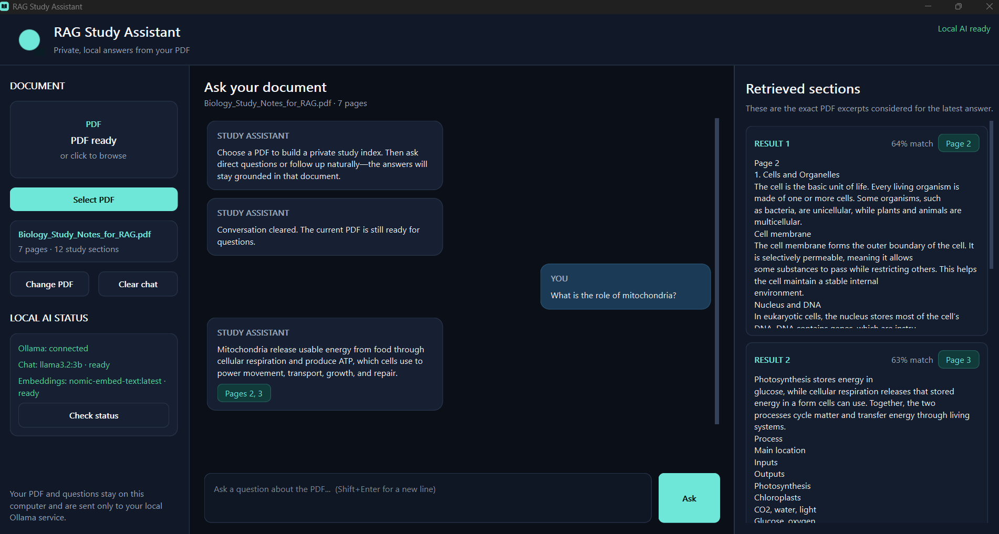

# AI Learning Pathway

## Featured Projects

### [RAG Study Assistant](projects/rag-study-assistant/)

A private, local Windows desktop application that lets users upload PDFs and receive grounded answers through local Ollama models, semantic retrieval, source-page citations, retrieved-evidence inspection, and conversation memory.

**Tools:** Python, PySide6, Ollama, PyPDF, NumPy, local embeddings, local language models, background workers, and PyInstaller

### [Automated GitHub Certification Uploader](projects/automated-github-certification-uploader/)

An n8n automation that retrieves certification files from a selected Google Drive folder, filters existing GitHub paths, removes duplicate content within the current batch with SHA-256, and uploads unique files to GitHub.

**Tools:** n8n, Google Drive, GitHub, OAuth, JavaScript, JSON, and binary file processing

## Certifications

- [Anthropic AI Fluency Certification](certificates/Anthropic%20AI%20Fluency%20Certification.pdf)
- [Anthropic Claude 101 Certification](certificates/Anthropic%20Claude%20101%20Certification.pdf)
- [Anthropic Claude Code 101 Certification](certificates/Anthropic%20Claude%20Code%20101%20Certification.pdf)
- [Building Systems with ChatGPT API](certificates/Building%20Systems%20with%20ChatGPT%20API.pdf)
- [ChatGPT Prompt Engineering](certificates/ChatGPT%20Prompt%20Engineering.pdf)
- [Fundamentals of Digital Marketing - Google](certificates/Fundamentals%20of%20Digital%20Marketing%20-%20Google.pdf)
- [Generative AI for Everyone Certification](certificates/Generative%20AI%20for%20Everyone%20Certification.png)
- [Getting Structured LLM Output](certificates/Getting%20Structured%20LLM%20Output.pdf)
- [LangChain Chat with Your Data - DeepLearning.AI](certificates/LangChain_Chat_with_Your_Data_Certificate.pdf)
- [n8n N8N101 Certificate](certificates/n8n%20N8N101%20Certificate.pdf)
