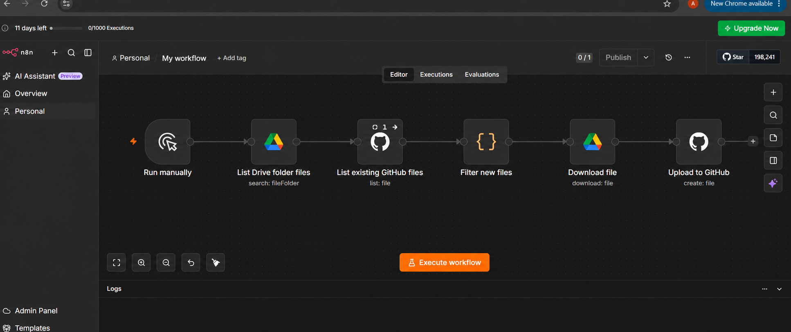
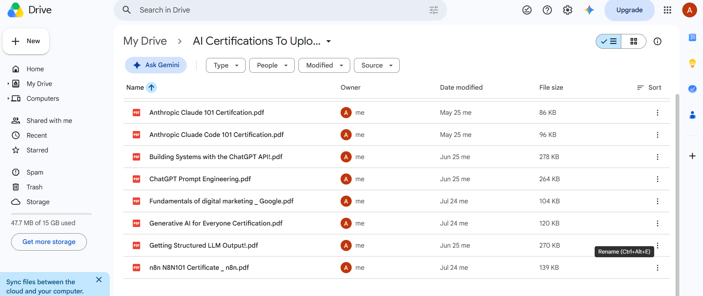
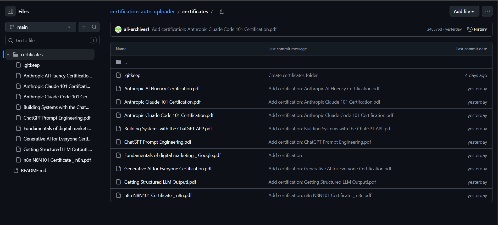

# Automated GitHub Certification Uploader

## Project Overview

The Automated GitHub Certification Uploader is an n8n workflow that retrieves certification files from one selected Google Drive folder and uploads new files to a GitHub repository. I built it to replace the repetitive process of downloading certificates from Drive and uploading them to GitHub one at a time.

The workflow handles multiple files in one run, keeps the original binary content intact, preserves each source filename, filters out GitHub paths that already exist, removes duplicate file content within the current batch, and creates a GitHub commit for every uploaded certificate.

The public workflow export is available at [`workflow/certification-uploader-workflow.json`](workflow/certification-uploader-workflow.json). Credential IDs, the private Drive folder ID, n8n instance metadata, webhook IDs, and workflow IDs have been removed. Importers must reconnect their own credentials and select their own source folder.

## Problem

My certificates were stored in Google Drive, while my public learning portfolio was maintained in GitHub. This created several practical problems:

- Downloading and uploading every certificate manually took unnecessary time.
- Certificate files needed to stay organized in the repository's `certificates/` folder.
- The same certificate could appear more than once, including under different filenames.
- A single workflow run needed to handle many Drive files instead of one hardcoded file.
- Existing GitHub paths needed to be protected so the workflow would not try to recreate them.
- PDF data had to remain binary from download through upload.

## Solution

I used n8n to connect Google Drive and GitHub in a deterministic seven-node workflow:

1. A manual trigger starts the workflow.
2. Google Drive searches the selected certification folder and returns all files.
3. GitHub lists the files already present in the destination `certificates/` folder.
4. A Code node compares source filenames with existing GitHub filenames and keeps only new paths.
5. Google Drive downloads every remaining file into the binary property named `data`.
6. A second Code node calculates a SHA-256 hash from each downloaded file and keeps the first item for every unique hash in the current run.
7. GitHub creates each unique file at a dynamic path and records the upload in a commit.

The exported workflow is inactive and uses a manual trigger. It does not contain a schedule or notification node.

## Workflow Architecture

```text
Run manually
  -> List Drive folder files
  -> List existing GitHub files
  -> Filter new files by existing GitHub filename
  -> Download each file as binary data
  -> Compute SHA-256 and deduplicate the current batch
  -> Upload each unique file to GitHub
```

The exact node order in the workflow JSON is:

```text
Run manually
  -> List Drive folder files
  -> List existing GitHub files
  -> Filter new files
  -> Download file
  -> Dedupe by content hash
  -> Upload to GitHub
```

## Detailed Node Explanation

### 1. Run manually

- **Node type:** `n8n-nodes-base.manualTrigger`
- **Purpose:** Starts a workflow run when I select **Execute workflow** in n8n.
- **Input:** No incoming item is required.
- **Output:** A trigger item that begins the main execution path.
- **Why it is needed:** The project was built and tested as an on-demand portfolio automation rather than a scheduled job.
- **Next connection:** Sends control to **List Drive folder files**.

### 2. List Drive folder files

- **Node type:** `n8n-nodes-base.googleDrive`
- **Operation:** Search the `fileFolder` resource with `returnAll` enabled.
- **Purpose:** Retrieves every non-trashed file from the selected Google Drive folder.
- **Input:** The trigger item and the configured Drive folder.
- **Output:** One n8n item per Drive file, limited to the file `id` and `name` fields.
- **Why it is needed:** It discovers files dynamically and avoids hardcoding a single certificate file ID.
- **Next connection:** Passes execution to **List existing GitHub files**.

### 3. List existing GitHub files

- **Node type:** `n8n-nodes-base.github`
- **Operation:** List files from the repository's `certificates` path.
- **Purpose:** Collects the names and Git object metadata for files already stored in GitHub.
- **Input:** The execution produced after the Drive listing.
- **Output:** GitHub file items containing fields such as `name` and `sha`.
- **Why it is needed:** The next node uses this list to avoid creating a file at a path that already exists.
- **Important behavior:** `executeOnce` prevents this repository listing from running once for every Drive item. `alwaysOutputData` and `continueRegularOutput` allow the workflow to continue when the destination folder is initially empty or unavailable.
- **Next connection:** Sends control to **Filter new files**.

### 4. Filter new files

- **Node type:** `n8n-nodes-base.code`
- **Purpose:** Compares all Drive filenames with the names returned from GitHub.
- **Input:** It reads the full outputs of **List Drive folder files** and **List existing GitHub files**.
- **Output:** Items containing only `{ id, name }` for Drive files whose names are not already in GitHub.
- **Why it is needed:** GitHub's create-file operation rejects an exact path that already exists. This node prevents those avoidable conflicts before any binary download occurs.
- **Implementation detail:** A JavaScript `Set` stores the existing GitHub filenames. GitHub items must contain both `sha` and `name`, which prevents error-passthrough items from being mistaken for existing repository files.
- **Next connection:** Each remaining item is sent to **Download file**.

### 5. Download file

- **Node type:** `n8n-nodes-base.googleDrive`
- **Operation:** Download.
- **Purpose:** Downloads the actual content of each candidate certificate.
- **Input:** The dynamic Drive file ID expression `{{ $json.id }}` and the corresponding file name.
- **Output:** The original item plus binary content in the `data` property. The binary filename is set from `{{ $json.name }}`.
- **Why it is needed:** A GitHub file upload needs the bytes of the PDF or image, not only Drive metadata.
- **Next connection:** Sends every downloaded binary item to **Dedupe by content hash**.

### 6. Dedupe by content hash

- **Node type:** `n8n-nodes-base.code`
- **Purpose:** Detects identical binary files within the current workflow batch, even when their filenames differ.
- **Input:** All downloaded items, each expected to contain `binary.data`.
- **Output:** The first item for every unique SHA-256 hash. The hash is also recorded as `json.contentHash` for execution debugging.
- **Why it is needed:** Filename comparison alone cannot identify two files with different names but identical bytes.
- **Implementation detail:** The node reads each binary buffer with `getBinaryDataBuffer`, calculates a SHA-256 digest with Node.js `crypto`, and stores seen hashes in a `Set`.
- **Binary preservation:** It returns the original n8n item objects rather than constructing replacement JSON items, so `binary.data` remains available to GitHub.
- **Next connection:** Sends only unique binary items to **Upload to GitHub**.

### 7. Upload to GitHub

- **Node type:** `n8n-nodes-base.github`
- **Operation:** Create file.
- **Purpose:** Creates each certificate in the repository and records the operation in Git history.
- **Input:** The unique item and its `binary.data` property.
- **Output:** GitHub's response for the newly created file and commit.
- **Path expression:** `certificates/{{ $('Filter new files').item.json.name }}`
- **Commit expression:** `Add certification: {{ $('Filter new files').item.json.name }}`
- **Why it is needed:** It is the final action that moves the certificate into the organized GitHub collection.

## File Processing

n8n represents a list of records as separate items. Because the Drive search uses `returnAll`, one run can discover multiple certificates. The filename filter creates one `{ id, name }` item for each new candidate, and the download node executes once for each of those items.

The Drive download stores bytes under `binary.data`. Its `fileName` option uses the current item's Drive name, which preserves the original name in the binary metadata. The SHA-256 Code node deliberately returns the original items so this binary property is not dropped.

The GitHub node has **Binary Data** enabled. It combines the fixed `certificates/` directory with the dynamically linked filename from **Filter new files**, producing paths such as:

```text
certificates/Example Certification.pdf
```

This design works for PDFs and other binary files supported by the source and destination services.

## Duplicate Protection

The workflow uses two checks with different responsibilities:

1. **Existing-path protection:** **Filter new files** compares Drive filenames with existing GitHub filenames. An exact filename match is removed before download so GitHub does not receive a create request for an existing path.
2. **Current-batch content protection:** **Dedupe by content hash** calculates SHA-256 from the downloaded bytes. If two candidates have identical content—even with different names—only the first item continues in that run.

Filename comparison alone is not sufficient because a certificate can be saved as `course.pdf` and `course-copy.pdf` while containing the same bytes. SHA-256 provides a deterministic content fingerprint, making those two files equal for the batch-level comparison.

When a duplicate hash is found, the later item is skipped. When a hash has not been seen, the original item is retained and moves to GitHub normally. If binary data is unexpectedly absent, the workflow records a null hash and allows the item to continue; the GitHub node will then surface the missing-binary error rather than silently treating the item as a duplicate.

The current implementation does **not** download and hash files that already exist in GitHub. Therefore, it can prevent same-content/different-name duplicates within one Drive batch, but it cannot prove that a differently named file is absent from the repository across separate runs. Repository-wide content comparison is listed as a future improvement.

## GitHub Integration

The workflow uses an n8n GitHub credential for both the list and create-file operations. The credential secret is stored inside n8n and is not embedded in the workflow JSON or this repository.

I used a fine-grained personal access token because its access can be restricted to one selected repository. The token needs repository **Contents: Read and write** permission: read access supports the existing-file listing, and write access supports file and commit creation. No broader account permission is required for this workflow.

For a least-privilege setup:

- Limit the token to the intended repository.
- Grant only the repository contents permission required by the nodes.
- Store the token only in n8n's encrypted credential store.
- Never paste the token into a Code node, expression, screenshot, README, or exported JSON.

Each successful create-file operation produces a Git commit using the configured dynamic commit message. The present workflow creates new files; it does not update an existing GitHub path.

## Google Drive Integration

The Drive search is scoped to one configured folder, filters out trashed items, returns every match, and requests only the `id` and `name` fields needed downstream. It does not perform a whole-Drive content scan.

The public export replaces the original private folder ID with `YOUR_GOOGLE_DRIVE_FOLDER_ID`. After import, the user must select their own folder in the node. Each returned ID then flows dynamically into the download expression, so no individual certificate ID is hardcoded.

Google Drive OAuth remains in n8n's credential store. The public JSON includes only a generic credential name so importers know which integration to reconnect.

## Screenshots and Proof

### Workflow editor



This redacted n8n editor screenshot shows the visible manual-trigger, Google Drive listing, GitHub listing, filename filter, download, and GitHub upload path. It proves the two-service workflow layout without exposing the private n8n tenant or workflow URL. The sanitized JSON is the authoritative artifact and also contains the later **Dedupe by content hash** node between download and upload.

### Selected Google Drive source folder



This screenshot shows multiple certification PDFs in the selected Drive folder. It demonstrates the multi-file source collection that the Drive search node processes and explains why `returnAll` is required.

### GitHub upload result



This screenshot shows the populated `certificates/` folder and per-file upload commits in the destination repository used during the workflow demonstration. It provides visual proof that the workflow created viewable certificate files in GitHub.

No separate execution-log or dedicated hash-comparison screenshot was supplied, so the project does not duplicate another image under a misleading filename.

## How to Use the Workflow

1. Download [`certification-uploader-workflow.json`](workflow/certification-uploader-workflow.json).
2. In n8n, create a workflow and choose **Import from file**.
3. Open **List Drive folder files** and connect a Google Drive OAuth credential.
4. Replace `YOUR_GOOGLE_DRIVE_FOLDER_ID` by selecting the intended certification folder.
5. Open **Download file** and connect the same Google Drive credential.
6. Open **List existing GitHub files** and connect a GitHub credential.
7. Select the GitHub owner, repository, and destination folder.
8. Open **Upload to GitHub**, connect the same GitHub credential, and confirm the owner and repository.
9. Confirm that the destination path begins with `certificates/`.
10. Execute the workflow manually with a small test set.
11. Review each node's output, especially the candidate list, binary `data`, `contentHash`, and GitHub response.
12. Confirm that the expected files and commits appear in GitHub.
13. Add update logic before rerunning with a path that already exists.

Because the supplied workflow uses a manual trigger, it is run on demand. Scheduling requires replacing or supplementing the trigger with an appropriate n8n trigger node.

## Required Credentials

- A Google Drive OAuth credential with access to the selected source folder.
- A GitHub credential backed by a fine-grained personal access token.
- Access to the selected GitHub repository.
- GitHub repository **Contents: Read and write** permission.

> Never commit OAuth secrets, personal access tokens, credential exports, private folder IDs, or unredacted execution data.

## Technologies Used

- n8n
- Google Drive
- GitHub
- GitHub API
- OAuth
- JSON
- JavaScript in n8n Code nodes
- Binary file processing
- SHA-256 content hashing

## Skills Demonstrated

- Workflow automation and deterministic node sequencing
- Google Drive and GitHub API integration
- OAuth and token-based authentication
- Least-privilege credential design
- Multi-item and binary file handling
- Dynamic n8n expressions
- GitHub file and commit automation
- Filename and content-based duplicate detection
- Error handling, debugging, and testing
- Technical documentation and public-artifact sanitization

## Challenges and Solutions

### Downloading the correct Drive file dynamically

Hardcoding one Drive file ID would process only one certificate. The Drive search returns each file's `id`, and the download node uses `{{ $json.id }}` so every candidate downloads dynamically.

### Uploading PDFs as binary files

Passing JSON metadata alone does not upload a valid PDF. The download node writes bytes to `binary.data`, the hash node keeps the original item, and the GitHub node has binary upload enabled.

### Preserving the filename

The download node sets its binary filename from `{{ $json.name }}`. The GitHub path and commit expressions then reuse the linked candidate name.

### Avoiding identical content under different names

The SHA-256 Code node fingerprints the downloaded bytes and skips later items when a hash has already appeared during the same execution.

### Avoiding duplicate GitHub paths

The workflow lists existing repository files before downloading candidates and removes exact filename matches. This avoids known create-file conflicts and unnecessary downloads.

### Protecting credentials and private identifiers

Credentials remain in n8n. The public export removes credential IDs, the original Drive folder ID and URL, webhook IDs, instance metadata, version identifiers, and workflow identifiers. The workflow screenshot also redacts the n8n tenant and workflow URL.

## Limitations

- GitHub rejects a create-file request when the exact path already exists; this workflow does not contain update logic.
- SHA-256 comparison covers candidate files in the current run, not differently named files already stored in GitHub.
- Large files can be affected by GitHub API, repository, n8n memory, or execution-size limits.
- The workflow depends on valid Google Drive and GitHub credentials.
- Changes to Drive folder access, repository access, token permissions, or destination paths can break the workflow.
- The workflow uses a manual trigger and does not run on a schedule.
- The Code nodes rely on n8n's support for Node.js `crypto` and binary buffer helpers.
- The screenshot was captured before the hash-deduplication node was visible in the editor; the supplied JSON is the source of truth for the completed seven-node flow.

## Future Improvements

- Add explicit update logic for corrected certificates at existing paths.
- Compare candidate hashes with a persistent manifest or hashes of repository files across runs.
- Normalize or sanitize filenames before creating GitHub paths.
- Organize certificates automatically by provider, topic, or year.
- Update the main portfolio README after successful uploads.
- Send a completion or failure notification.
- Log uploaded files and content hashes in Google Sheets or a database.
- Add retry, error-routing, and partial-failure handling.
- Replace the manual trigger with a schedule or Drive event trigger.
- Create a dashboard that tracks completed certifications.

## Security

- Tokens and OAuth secrets are never committed.
- Credentials remain in n8n's credential store.
- GitHub access follows least-privilege permissions and is limited to the required repository where possible.
- Drive access is scoped operationally to the selected certification folder.
- Public exports remove private IDs and instance metadata.
- Sensitive URLs and execution screenshots are redacted before publication.
- Credential values should be rotated immediately if they are ever exposed.

## What I Learned

I learned how n8n nodes pass structured items through a deterministic workflow and how triggers, searches, transformations, downloads, and actions fit together. I learned to use Google Drive search results instead of relying on one hardcoded file ID, and I became more comfortable with expressions such as `{{ $json.id }}` and linked-node filename expressions.

I also learned that files must be treated differently from ordinary JSON. A valid PDF upload depends on preserving binary data throughout the execution, including when a Code node transforms or filters items. Debugging the earlier missing-binary behavior showed me why returning the original item objects matters.

On the GitHub side, I learned how repository contents permissions, dynamic paths, and commit messages work together. I also learned that duplicate handling has multiple layers: checking an existing filename prevents path conflicts, while SHA-256 detects identical bytes under different names during a batch.

Finally, I learned that a portfolio automation is not complete until it is tested, documented, and sanitized. A public workflow should explain its limitations clearly and must not expose tokens, OAuth details, private Drive IDs, or n8n instance metadata.

## Project Result

The completed workflow can process multiple certification files from one Google Drive folder, filter existing GitHub filenames, download candidate files as binary data, remove repeated content within the current batch, and upload unique certificates to an organized GitHub folder. It reduces repetitive manual work while keeping the integration understandable, testable, and safe to share as a public portfolio project.
