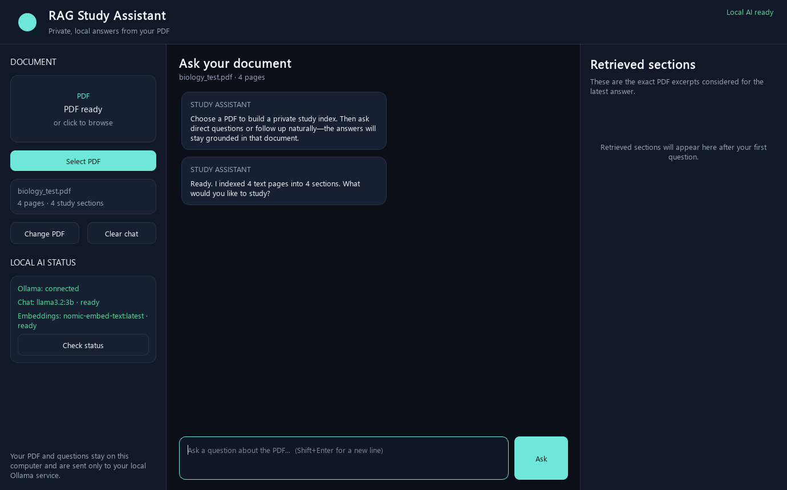
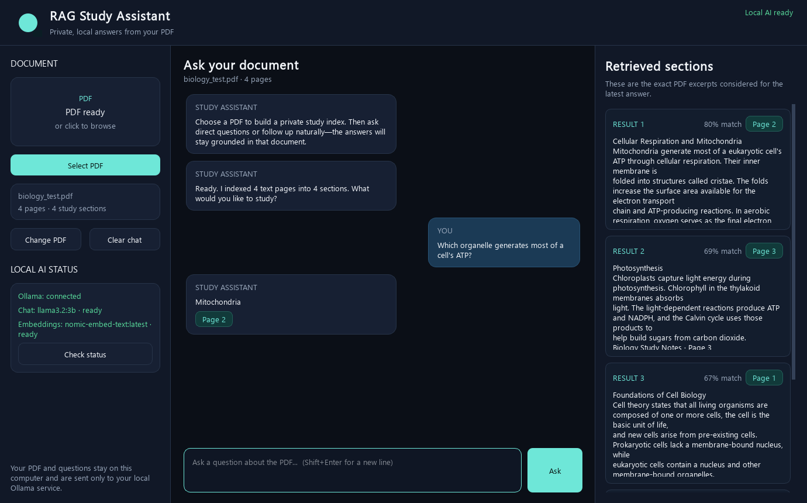
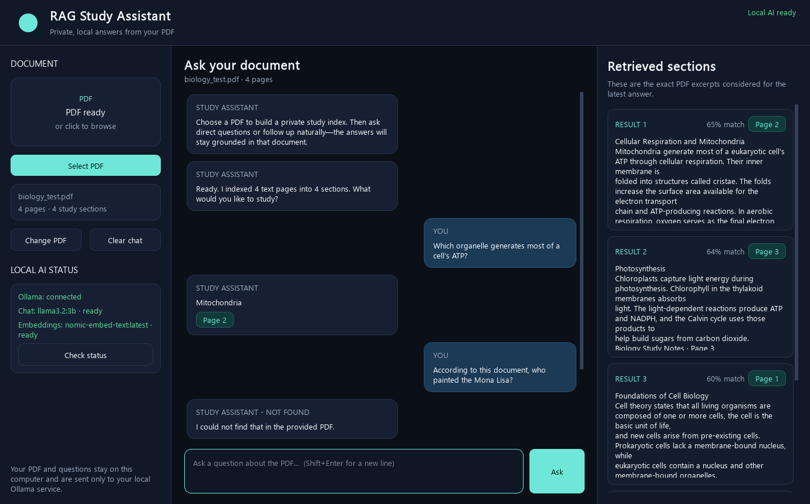
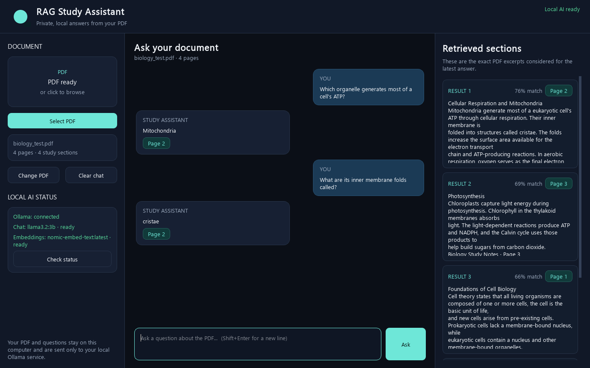

# RAG Study Assistant

## Project Overview

RAG Study Assistant is a private, local Windows desktop application for studying text-based PDF documents. A user can select or drag a PDF into the application, wait while it is indexed, and then ask natural-language questions about its contents. Answers are generated through local Ollama models and are shown with supporting PDF page numbers and the retrieved document sections used as evidence.

The application uses Retrieval-Augmented Generation (RAG) to:

- Extract text from the PDF one page at a time.
- Preserve page metadata for citations.
- Divide page text into overlapping chunks.
- Convert chunks into embedding vectors.
- Keep normalized vectors in memory.
- Embed each user question and retrieve the most similar chunks.
- Give the retrieved evidence to a local chat model with strict grounding instructions.
- Return a concise answer or an explicit not-found response.
- Display supporting page numbers and retrieved chunks.
- Use recent conversation history to interpret follow-up questions.

The application is not training or fine-tuning a new language model. It uses existing models that run locally through Ollama.

## The Problem

Long study PDFs are difficult to search manually. A student may know that an answer is somewhere in a document but still spend significant time scrolling, using exact-keyword search, and comparing sections.

General-purpose chatbots introduce additional concerns:

- They may answer from outside knowledge rather than the supplied notes.
- They can produce plausible but unsupported statements.
- They may not show where an answer came from.
- Uploading private notes to an external service may be inappropriate.
- A student cannot easily inspect the evidence considered by the model.

The original Streamlit prototype proved that the RAG workflow could work, but it opened in a browser and did not feel like a finished portfolio application. The final system needed a polished native-style interface, clear loading and error states, local model visibility, and a packaged executable that did not require a terminal or browser during normal use.

## The Solution

The prototype was rebuilt as a PySide6 Windows desktop application and packaged with PyInstaller.

A user can:

1. Launch the desktop application.
2. Select a PDF through File Explorer or drag it onto the upload area.
3. Wait while the PDF is read, chunked, and embedded.
4. Ask a question in the chat interface.
5. Receive an answer grounded in retrieved PDF evidence.
6. Verify the supporting page numbers.
7. Inspect the exact retrieved sections and match scores.
8. Ask follow-up questions using conversational context.
9. Change the active PDF.
10. Clear the conversation while keeping the current PDF index.

PDF processing and model calls run in background workers so the interface remains responsive.

## Architecture

```text
PDF Upload
  -> Text Extraction
  -> Page Metadata
  -> Text Chunking
  -> Embedding Generation
  -> In-Memory Vector Matrix
  -> Similarity Retrieval
  -> Grounded Prompt
  -> Local Chat Model
  -> Answer + Source Pages
  -> Conversation Memory
```

The system has two main stages.

### Indexing Stage

```text
PDF
  -> PyPDF page extraction
  -> page-number metadata
  -> 900-character overlapping chunks
  -> nomic-embed-text embeddings
  -> normalized NumPy vector matrix
```

Indexing happens when a PDF is loaded. The resulting chunk records and vectors remain in memory until another PDF is selected or the document is cleared.

### Question Stage

```text
User question
  -> question plus recent-question context
  -> question embedding
  -> cosine similarity against stored vectors
  -> top five chunks
  -> grounded JSON prompt
  -> llama3.2:3b
  -> validated answer and source pages
```

Retrieval finds evidence; it does not write the final answer. The chat model receives the evidence and writes the response under strict grounding instructions.

## Technologies Used

### Final desktop application

- Python 3
- PySide6
- Ollama local HTTP API
- PyPDF
- NumPy
- In-memory normalized vector storage
- Custom word-aware overlapping text splitter
- `nomic-embed-text:latest` local embedding model
- `llama3.2:3b` local chat model
- Qt `QThreadPool` and `QRunnable`
- PyInstaller
- PowerShell build script
- JSON release-test output
- ReportLab for the generated integration-test fixture

### Preserved prototype

The historical Streamlit prototype uses Streamlit and LangChain components, including `RecursiveCharacterTextSplitter`, `InMemoryVectorStore`, `OllamaEmbeddings`, and `ChatOllama`. Those LangChain dependencies are not part of the final desktop runtime in `requirements.txt`; the desktop implementation calls Ollama directly and performs vector similarity with NumPy.

## Local AI Models

Both required models run locally through Ollama.

### `nomic-embed-text:latest`

This is the embedding model. It converts:

- PDF chunks
- User retrieval queries

into vectors that can be compared mathematically. Testing confirmed that the installed model returned 768-number vectors.

```text
Similar meaning
  -> similar vectors
  -> closer directions in vector space
```

The individual numbers are not manually interpreted. Their combined geometric relationship is what makes semantic retrieval possible.

**Embedding model = finds relevant information.**

### `llama3.2:3b`

This is the chat model. It reads:

- The current question
- The retrieved PDF excerpts
- The grounding instructions
- Recent conversation history used for reference resolution

It returns a JSON object containing whether an answer was found, the answer text, and supporting page numbers.

**Chat model = writes and explains the answer.**

Neither model is included in the executable or repository.

## Detailed File Explanation

### `src/app.py`

Launches the PySide6 application, configures the Qt application and font, creates the main window, and starts the event loop. It also contains release-only smoke, screenshot, and packaged-integration switches used to verify the executable.

It imports the interface from `main_window.py`, the backend from `rag_engine.py`, constants from `config.py`, and visual helpers from `styles.py`.

### `src/main_window.py`

Implements the desktop interface:

- Main application window and header
- PDF drag-and-drop area
- File Explorer PDF picker
- Selected-document details
- Change PDF and clear-chat actions
- Ollama and model status panel
- User and assistant message bubbles
- Question editor and Ask button
- Loading messages and progress bars
- Retrieved-section inspector
- Match percentages and source-page badges
- Helpful error banner

It sends long-running work to `TaskWorker` instances and receives progress, result, error, and completion signals on the UI thread.

### `src/rag_engine.py`

Owns the current PDF index and conversation memory. Its responsibilities include:

- Reading PDFs with PyPDF
- Extracting page text
- Creating `DocumentChunk` records with page metadata
- Requesting chunk embeddings from Ollama in batches
- Normalizing and storing embeddings in a NumPy matrix
- Embedding retrieval queries
- Calculating cosine-similarity scores
- Selecting the five highest-scoring chunks
- Building a grounded prompt
- Calling the local chat model
- Parsing and validating the model's JSON response
- Restricting source pages to retrieved pages
- Recording recent question-answer history

An `RLock` protects shared state while background operations use the engine.

### `src/workers.py`

Defines a reusable `TaskWorker` based on Qt's `QRunnable` and a `WorkerSignals` object. It runs blocking functions through `QThreadPool` and emits:

- `progress`
- `result`
- `error`
- `finished`

This keeps PDF extraction, embedding calls, retrieval, and answer generation off the main UI thread.

### `src/utils.py`

Contains shared functionality:

- Local Ollama HTTP requests through `urllib`
- Proxy bypass for the local `127.0.0.1` service
- Friendly connection and response errors
- PDF path validation
- PDF text cleanup
- Word-aware overlapping chunking
- JSON response recovery and validation
- PyInstaller resource-path resolution

### `src/styles.py`

Defines the professional dark color system and Qt stylesheet. It also creates the application icon programmatically and loads an available Windows UI font for normal and restricted rendering sessions.

### `src/config.py`

Centralizes:

- Application name and version
- Ollama endpoint
- Chat and embedding model names
- Chunk size and overlap
- Embedding batch size
- Retrieval count
- Memory length
- Exact not-found response
- Grounded JSON system prompt

### `prototype/prototype_streamlit.py`

Preserves the original Streamlit prototype. It demonstrates the earlier browser-based workflow and its LangChain components. It is retained for project history and is not launched by the desktop executable.

### `requirements.txt`

Pins the desktop, test-fixture, and packaging dependencies needed to run tests, launch from source, and build the executable.

### `RAGStudyAssistant.spec`

Defines the one-file PyInstaller build from `src/app.py`. It creates a windowed executable with `console=False` and excludes many unused PySide6 modules to reduce output size.

### `build.ps1`

Runs the spec file with the project's virtual-environment Python executable and writes the generated application to `dist/RAG Study Assistant.exe`.

### `LAUNCH_INSTRUCTIONS.txt`

Provides a short normal-use checklist for the packaged release.

### `tests/test_core.py`

Contains deterministic unit tests for:

- Short-text chunking
- Long-text chunk sizing and overlap behavior
- Fenced JSON response parsing

### `tests/integration_ollama.py`

Runs the complete local RAG path:

- Verifies Ollama and both models
- Generates a safe biology fixture
- Loads and indexes the PDF
- Tests a direct question
- Tests missing information
- Tests a follow-up question
- Writes detailed local JSON results

The generated PDF and JSON result are ignored by Git.

### `test_data/create_biology_pdf.py`

Generates a four-page biology PDF containing known facts about cell biology, mitochondria, photosynthesis, and genetic information. It provides a reproducible non-personal integration fixture.

### `assets/`

Contains public screenshots showing the application and verified test states. They do not expose local paths, tokens, credentials, or private documents.

### `release/RAG Study Assistant.exe`

Contains the verified one-file Windows build. It is generated from the included source and does not contain the Ollama models. The published binary is approximately 65.3 MB, below GitHub's 100 MB per-file limit.

### `BUILD_REPORT.md`

Records the release artifact, actual validation performed, included and excluded files, and privacy checks without publishing local filesystem paths.

## PDF Loading

When a PDF is selected:

1. `validate_pdf_path` confirms that the path exists, is non-empty, and has a `.pdf` suffix.
2. PyPDF opens the document.
3. Password-protected PDFs are rejected unless they can be opened without a password.
4. Text is extracted page by page.
5. Pages without usable extracted text produce no chunks.
6. Every chunk receives the original one-based PDF page number.
7. A file-level `PdfSummary` records the filename, path, page count, readable-page count, and chunk count.

If no readable text is found, the application explains that a scanned PDF may need OCR. OCR is not implemented in the current version.

## Chunking

The final application uses:

- Chunk size: **900 characters**
- Chunk overlap: **150 characters**

The custom splitter cleans extraction artifacts, joins words broken by line-end hyphenation, preserves useful paragraph breaks, and prefers paragraph, sentence, or word boundaries near the target size.

Overlap reduces the chance that a useful sentence is separated from its surrounding context. Smaller chunks can make retrieval more focused, while larger chunks provide more context. The current values match the working prototype's size and overlap while using a custom desktop implementation.

## Embeddings

An embedding is a numeric representation of a text's semantic meaning. The application sends chunks to `nomic-embed-text:latest` in batches of 16. The returned vectors are converted to a NumPy `float32` matrix and normalized to unit length.

The same model embeds each retrieval query. Because document and query vectors share the same embedding space, a dot product between normalized vectors behaves as cosine similarity.

Testing confirmed 768 dimensions for the installed embedding model. This is an observed model output, not a hardcoded assumption in the application.

## Vector Store

The final desktop implementation uses an in-memory NumPy matrix rather than an external vector database or LangChain vector store.

The engine keeps:

- Chunk index
- Chunk text
- PDF page number
- Normalized embedding vector
- File-level PDF summary

The index is rebuilt whenever a new PDF is successfully loaded. It is not persisted between application launches.

## Retrieval

For each question:

1. The current question is combined with recent user-question context when conversation history exists.
2. The retrieval query is embedded.
3. Its normalized vector is compared with all stored chunk vectors.
4. NumPy sorts the similarity scores.
5. Up to five highest-scoring chunks are selected.
6. The UI displays those chunks, their PDF pages, and score percentages.

Retrieval only identifies evidence. The retrieved panel makes that evidence inspectable before or after reading the generated answer.

## Grounded Answering

The system prompt tells the chat model to:

- Use only the supplied PDF excerpts as factual evidence.
- Use conversation history only to resolve follow-up references.
- Avoid outside knowledge and unsupported assumptions.
- Return an exact not-found response when the evidence is insufficient.
- Return supporting pages in structured JSON.

The engine then validates that reported source pages were among the retrieved pages. A positive answer is always displayed with at least one source page. A not-found result uses:

> I could not find that in the provided PDF.

**Grounded** means supported by the supplied PDF excerpts.

**Ungrounded** means unsupported by those excerpts.

RAG materially reduces unsupported answers, but retrieval and local model generation are probabilistic and cannot guarantee perfect accuracy.

## Conversation Memory

The engine keeps the latest four question-answer turns. Recent user questions are included in the retrieval query, and recent question-answer pairs are provided to the chat model for reference resolution.

Example:

```text
User: What is cellular respiration?
User: Where does it happen?
```

The history helps the system understand that "it" refers to cellular respiration. The PDF excerpts remain the only permitted source of factual truth; memory supplies conversational context, not new evidence.

Selecting a new PDF clears history. The Clear chat button removes history while keeping the current document index.

## User Interface

The interface is organized into three panels:

### Document sidebar

- Drag-and-drop PDF target
- File Explorer selection button
- Current PDF name
- Page and chunk counts
- Change PDF button
- Clear chat button
- Ollama connection status
- Required model readiness
- Local-processing notice

### Chat workspace

- Application title and current-document subtitle
- User and assistant message bubbles
- Source-page badges
- Question editor
- Enter-to-send and Shift+Enter behavior
- Ask button
- Progress and activity feedback
- Dismissible error messages

### Retrieved sections inspector

- Exact retrieved PDF excerpts
- Retrieval order
- Match percentage
- Source page badge

This layout makes the complete RAG flow visible in one demonstration: document state on the left, question and answer in the center, and retrieved evidence on the right.

## Background Processing

PDF indexing and answer generation are blocking operations. Running them directly in a button handler would freeze painting and input.

`TaskWorker` runs engine methods through `QThreadPool.globalInstance()`. Qt signals safely deliver progress and results back to the main thread. Controls are temporarily disabled while a task is active and are restored when the worker emits `finished`.

## Privacy

- The application reads PDFs from the local filesystem.
- Model requests are sent to the local Ollama service at `127.0.0.1`.
- No cloud LLM API key is required by this implementation.
- The executable does not contain Ollama model files.
- The repository does not include the user's study PDFs.
- Generated integration data uses a synthetic biology fixture.

These statements apply to the application code itself. Operating-system telemetry, Ollama installation choices, or separately installed software are outside this repository's control.

## Ollama Requirements

Install and start Ollama, then ensure both models are available:

```powershell
ollama pull llama3.2:3b
ollama pull nomic-embed-text:latest
```

If Ollama is installed but not on `PATH`, use:

```powershell
& "$env:LOCALAPPDATA\Programs\Ollama\ollama.exe" pull llama3.2:3b
& "$env:LOCALAPPDATA\Programs\Ollama\ollama.exe" pull nomic-embed-text:latest
```

The application's Check status button verifies the service and exact model names.

## Installation

From `projects/rag-study-assistant`:

1. Install a current 64-bit Python 3 release.
2. Install and start Ollama.
3. Pull both required models.
4. Create a virtual environment.
5. Install dependencies.
6. Launch the source application.

```powershell
python -m venv .venv
& ".\.venv\Scripts\python.exe" -m pip install --upgrade pip
& ".\.venv\Scripts\python.exe" -m pip install -r requirements.txt
& ".\.venv\Scripts\python.exe" .\src\app.py
```

Using the virtual environment's Python executable directly avoids reliance on PowerShell activation scripts.

## Running the Packaged App

1. Start Ollama.
2. Confirm that `llama3.2:3b` and `nomic-embed-text:latest` are installed.
3. Open `release/RAG Study Assistant.exe`.
4. Select or drag in a text-based PDF.
5. Wait for indexing to finish.
6. Ask questions and inspect the answer sources.

The executable packages Python and application dependencies, but not Ollama or either model.

## Building the Executable

After installing `requirements.txt` into `.venv`, run:

```powershell
powershell -ExecutionPolicy Bypass -File .\build.ps1
```

Equivalent direct command:

```powershell
& ".\.venv\Scripts\python.exe" -m PyInstaller --clean --noconfirm .\RAGStudyAssistant.spec
```

The build is written to:

```text
dist/RAG Study Assistant.exe
```

The spec uses one-file, windowed packaging, so normal use opens the desktop window without a console.

## Screenshots and Proof

### Desktop Application Overview


The supplied overview shows the three-panel desktop interface with a real seven-page biology PDF, a user question, a grounded mitochondria answer, source-page badges, retrieved chunks, match percentages, and ready local models. It demonstrates the complete question-stage pipeline in one view.

### PDF Successfully Indexed



This verified test-state screenshot shows the generated biology fixture after loading, including its page count and chunk count. It represents the completed indexing stage before a question is submitted.

### Grounded Answer



This test-state screenshot shows the direct ATP question, the answer, a page-2 source badge, and retrieved evidence. It demonstrates semantic retrieval followed by grounded generation.

### Missing Information Test



This test-state screenshot shows the exact not-found response for a question not answered by the biology fixture. It demonstrates that the model can decline rather than fill the gap with outside knowledge.

### Conversation Memory



This test-state screenshot shows a follow-up about "its" inner membrane folds resolving to the previously discussed mitochondrion and answering "cristae" from page 2.

### Local Model Status


This test-state screenshot shows Ollama connected and both configured models ready. It proves the application checked the local service and exact model names.

No screenshot contains a token, credential, local path, or private document.

## Testing

The final release was verified with:

- Source compilation
- Application startup
- UI rendering
- PDF generation and loading
- Page-by-page text extraction
- Chunk creation
- Embedding creation
- In-memory vector retrieval
- Direct-question behavior
- Exact missing-information behavior
- Follow-up memory behavior
- Ollama status check
- Required-model availability check
- Three deterministic unit tests
- Packaged executable smoke test
- Packaged executable end-to-end integration test
- Executable binary scan for local paths and credential markers

The packaged release test reported:

```text
pdf_loaded: true
direct_answer: true
missing_information: true
follow_up_memory: true
```

## Example Tests

### Direct question

```text
Which organelle generates most of a cell's ATP?
```

Verified result: `Mitochondria`, supported by page 2.

### Missing information

```text
According to this document, who painted the Mona Lisa?
```

Verified result:

```text
I could not find that in the provided PDF.
```

No source page was claimed.

### Follow-up question

```text
What are its inner membrane folds called?
```

Verified result: `cristae`, supported by page 2. The pronoun depended on the earlier mitochondria discussion.

The supplied overview separately shows a successful `What is the role of mitochondria?` demonstration on a seven-page biology document. Tests not recorded in the release evidence are not presented as verified results.

## Challenges and Solutions

### Python command and environment issue

A pre-existing virtual environment inside OneDrive contained cloud reparse-point executables that Windows would not run in the build session.

**Solution:** Created an isolated virtual environment from a known Python runtime and invoked its Python executable directly.

### PowerShell activation portability

Activation scripts can be affected by execution policy and are not required for a build.

**Solution:** Used direct commands such as `& ".\.venv\Scripts\python.exe"` in documentation and scripts.

### Ollama path issue

Ollama was installed and running but was not available through the shell `PATH`.

**Solution:** Used its local HTTP API for the application and the full Windows executable path for optional model-management commands.

### Model readiness

Local applications can fail when the service is stopped or an exact model tag is missing.

**Solution:** Added a model-status check for Ollama, `llama3.2:3b`, and `nomic-embed-text:latest`, with visible ready, missing, or offline states.

### UI freezing risk

PDF extraction, embedding requests, and chat generation can block for seconds or minutes.

**Solution:** Moved blocking operations to `QRunnable` workers managed by `QThreadPool`.

### Browser prototype limitation

The Streamlit version demonstrated the RAG idea but did not feel like a standalone Windows application.

**Solution:** Rebuilt the interface in PySide6 and packaged it with a windowed PyInstaller configuration.

### Packaging inside a synchronized folder

OneDrive briefly locked an intermediate PyInstaller cache directory during release work.

**Solution:** Used an isolated build-intermediate directory and copied only the verified final executable into the project.

## Limitations

- Ollama must be installed and running.
- Both required models must be downloaded separately.
- The vector index is rebuilt whenever a PDF is loaded.
- The index is not persisted between launches.
- Large PDFs take longer to extract and embed.
- Image-only PDFs may require OCR.
- Only PDF input is supported.
- A local 3B model may be slower or less capable than larger models.
- Semantic retrieval can select imperfect chunks.
- RAG reduces hallucinations but does not eliminate them.
- Match percentages are raw cosine-similarity scores presented as percentages, not calibrated confidence.
- The executable is large because it includes Python, PySide6, NumPy, PyPDF, and packaging support.
- The release binary is not a Windows installer and may not be code-signed.

## Future Improvements

- Support multiple PDFs in one study session.
- Add a persistent vector database.
- Add OCR for scanned PDFs.
- Export chat history.
- Highlight quoted evidence in retrieved chunks.
- Add clickable PDF page previews.
- Add retrieval evaluation datasets.
- Add hybrid keyword and semantic search.
- Rerank retrieved chunks.
- Make chunk size and overlap configurable.
- Make retrieval count configurable.
- Support additional local model choices.
- Create a signed Windows installer.
- Offer optional Ollama startup assistance.
- Add guided model-download checks.
- Add an update system.
- Save study libraries.
- Generate flashcards.
- Generate quizzes.
- Create study summaries.
- Add an exam-preparation mode.

These are roadmap ideas, not current features.

## Skills Demonstrated

- Python programming
- Windows desktop application development
- PySide6 interface design
- RAG architecture
- PDF processing
- Text cleaning and chunking
- Embeddings
- Vector normalization and cosine similarity
- Local Ollama integration
- Prompt grounding
- Structured model responses
- Source-page citation
- Conversation memory
- Background processing
- Error handling
- Deterministic and integration testing
- Windows executable packaging
- GitHub portfolio documentation
- Privacy-aware AI design

## What I Learned

I learned that a language model and an embedding model have different jobs. The embedding model represents semantic meaning as vectors and makes retrieval possible, while the chat model uses retrieved evidence to write a readable answer.

I learned why retrieval must happen before generation, how chunk size and overlap change the evidence available to the model, and how page metadata makes source citations possible. Embeddings alone can search for related text, but they do not rewrite that text into a focused answer.

I also learned how grounding instructions change the goal from producing any plausible answer to producing an answer supported by the uploaded document. A not-found response is a successful result when the document does not contain the requested information.

Working with Ollama helped me understand how local models are installed, addressed by model tag, and accessed through a local service. Moving the blocking operations into Qt workers showed me why desktop responsiveness depends on separating long-running work from the main UI thread.

With implementation and debugging support, I learned how to move a browser prototype into a structured, packaged desktop application, diagnose Windows path and environment problems, verify the final executable, and document only behaviors supported by the code and tests.

## Project Result

The completed project is a native-style Windows desktop RAG application that allows users to upload a PDF, ask natural-language questions, receive answers grounded in the document, verify source pages, inspect retrieved evidence, and use follow-up questions while keeping model processing local through Ollama.
